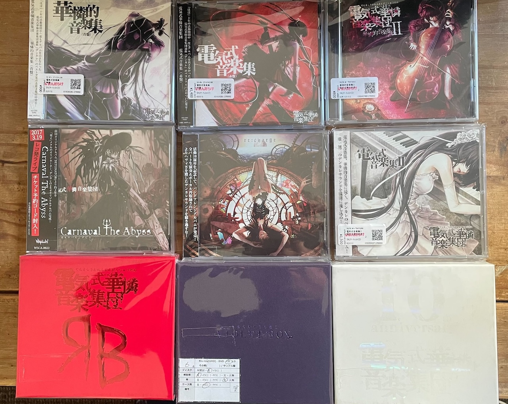
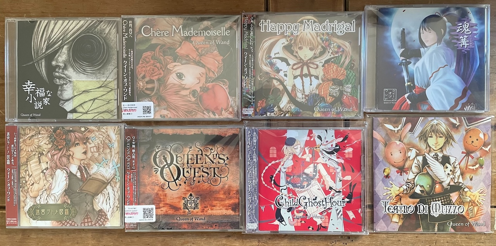
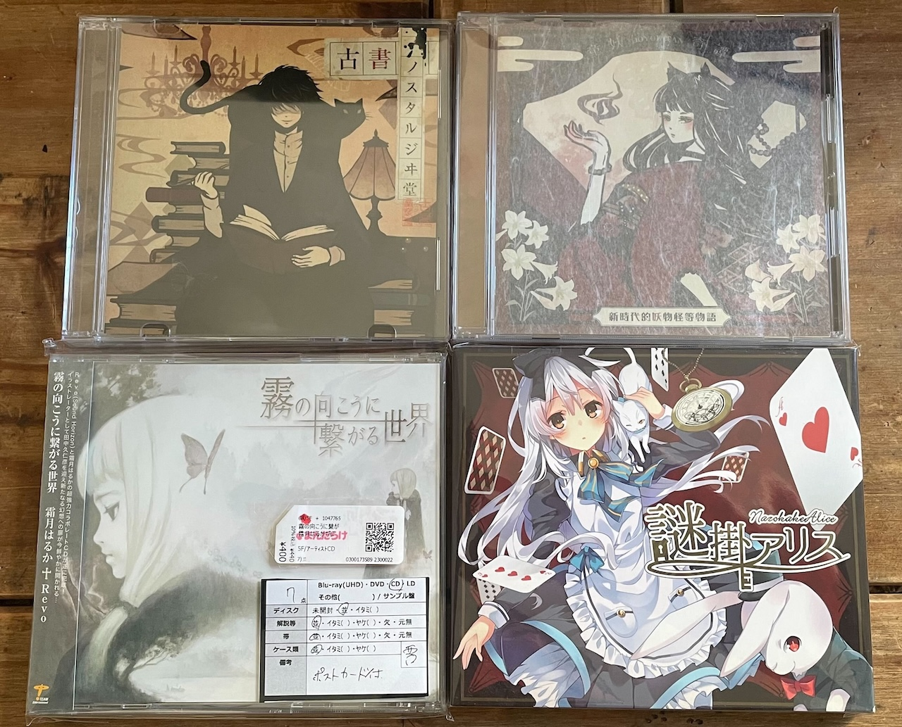
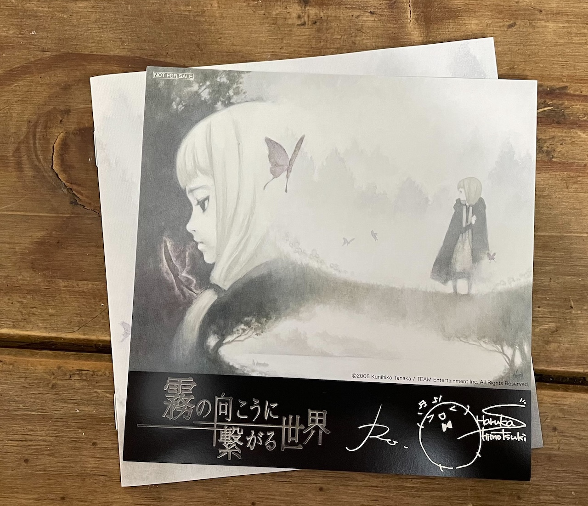

上次买CD好像已经是一年之前去日本旅行+霜月演唱会的时候，跟一堆漫画一起带货了一堆霜月的碟和几张中惠光城的碟。今年忽然想起买碟倒不是因为去年的CD消耗完了（其实可能只听了2/3），而是始于狡猾的Mandarake给我发提示说之前一直在等货的Absolute Castaway的《ABCAS Chronicle I》有货了。作为一直以来对中惠光城大正风毫无抵抗力的人，去年在日本只买到了《ABCAS Chronicle II》确实一直有种缺憾感。因此这一次没有错失机会而是直接无视运费拍板拿到。1月底听完之后颇有意犹未尽之感，加之彼时彼刻决定拒绝氪金支持阿尔特塔的垃圾足球，让年初的娱乐预算有了结余，于是决定在春节前再多购入一些。

消费陷阱就是这样的，本来打算多买2-3张中惠光城的碟就发展成了为“节约运费”而进行的“大放水”。

回过神来，已是豪购！！

感谢DHL和经济全球化。10年前购买第一张《月追いの都市 Acoustic Story Live》的时候还得琢磨半天怎么搞转运公司，折腾很久还要担心被税；现如今成熟的中古品交易中介Mandarake+DHL只需要一张Visa卡就可以在一周之内获得音乐盒子开箱的机会！

细数了一下，单独的CD是18张碟，加上デンカレ的三个合集里面共计7张碟，应该够我美美听上一年半载了！

以下分别拆箱，顺便记一些自己与某些歌的体验。

1. 電気式華憐音楽集団

所谓「電気式華憐音楽集団（デンカレ）」不过是妖精帝國的里界马甲。现在想来自己也并没有多么执念于什么黑暗风GalGame，碰到デンカレ就和其他喜欢的组合一样纯属一系列巧合。当年YUI靠未来日记OP1「空想メソロギヰ」的“三百个gay”一夜出圈之后，我就开始关注妖精帝國。而从“关注”变成“爱听”的绝对催化剂则是靠OSU！里的几张名图。当年的硬核mapper最钟爱的几首黑暗风摇滚，从新手村之壁的Wahrheit，到虽然节奏简单但却洗脑的トリカゴ，以及10-0-0的神插入曲霊喰い，都是属于如果不幸在20岁之前大量食用都有中毒风险的作品。

经典的“强化学习”之路就此开始。在虾米的智能推荐中，扩大妖精帝國的曲库多少就会提升被推到デンカレ作品的概率（毕竟纯粹是一人双役）。而与最终让我欲罢不能，至今仍然高居赶工单曲循环播放top的Distorted Pain相遇自然就是偶然中的必然了。其实之前购入过的Blue Box的《DENKARE THE BEST》里已经收录了包括Distorted Pain在内的几首我非常喜欢的デンカレ作品。之所以想要系统买一堆，一来是有一首Distorted Pain的重金属remix版只收录在White Box的《Re：charge》这张专辑里；另外是有一首暗黑风remix的鸟之诗，之前听过一次之后就非常喜欢，收录在Violet Box的《Inspirante》里。既然可以一网打尽何乐而不为呢！

当然，氪金总是盲目的。拿到成品之后才意识到自己按照单独CD购入的《Re：charge》和若干张《華憐的音楽集》其实是anniversary box的一部分。想到去年stellatram魔塔三部曲再版的时候自己重新下了一单，再之前自己家里有一份的志方碟来英国之后又买了一份，有一张备份很好，司空见惯！泉此方就曾说过，对任何作品的爱至少可以支撑买三份：一份收藏用，一份布道用，还有一份自己享受用（雾233333）。

2. Queen of Wand

如果说跟デンカレ的偶遇还有OSU！和未来日记的助力，跟Queen of Wand这个团的偶遇则是纯靠虾米。当年它的学习曲库应该并不大，除了上述的几首歌，一些霜月，一些志方，一些海猫，每天的30首就足够有10%左右的会心一击率，比起QQ音乐简直准确太多！Queen of Wand的几首名曲就是纯在虾米上听到之后开始进行团体定位而偶遇的。

最早听到的应该是收录在《幸福な小説家》的「不幸せな読者」（这曲名和专辑名其实味道就很棒了！）。另外在《Chère Mademoiselle》这张专辑里的好几首都是当时就印象深刻的作品。这次比较遗憾的是一直在找的收录在《王女さまの秘密》里的「Innocent Blue」，一首极其好听的纯小提琴曲，这次能买到的碟里全没有。此外还有一张神专《明滅王女》，里面收录的「雨粒人魚姫」和「花岬」都是读博的时候实验做到头大时候我的心灵慰藉。要入手，会继续的！

3. 老朋友——中惠霜月（友情出场Revo）

有关听霜月的历史之前听演唱会的记录里已经写过了（[【闪回】霜月はるか　蛍蝶ノ祭]() ），不再赘述。跟中惠光城的偶遇则更有意思：最早还是源自于OSU！的名图，霜月翻唱的another flower版「金平糖レトロチカ」。这首也是属于初见一面杀的神作。之后因为觉得在旋律以外歌词也很棒，再向上溯源发现原曲收录在中惠光城的2014年C86同名大正风神专辑《金平糖レトロチカ》，MV也超棒。比起霜月翻唱版更浓郁的幻想风，中惠光城原版的作品编曲和歌词更贴，扑面而来的某种悸动的怀古魔幻气息可谓让人沉醉其中。我到现在仍然记得第一次想要买中古品发现卖切时懊恼不已的情绪，以及之后成功入手的时候欣喜若狂的回忆。

故事还没有结束。之后在寻找another flower version的时候毫无意外地购入了以中惠和霜月互唱/混唱为主打的另一张神专《Cross Bouquet》。这里面脍炙人口的作品太多，比如出圈的「Mirage」，词曲结合一级棒的「Lost Nostalgia」，真是霜月和中惠联动的神中之神。

最后，一段玄妙的偶遇怎能没有伏笔回收？——直到前几年，我才偶然发现自己购入的第一张霜月《月追いの都市 Acoustic Story Live》里面念白正是中惠光城。当年虽然看了很多次booklet，但因为不太在意念白而只关注了歌词，中惠的名字又没有太多记忆点，就埋藏在了潜意识没认出来。——但有缘分总会相遇的！

这次买进的三张中惠最期待的是《謎かけアリス》。也是属于从《Cross Bouquet》里初听翻唱版就被抓耳，阅读歌词并听过原版后更加佩服... 总觉得中惠光城写歌词的才华真是太美妙了。和日山尚纯粹的幻想世界不同，她歌词的某种魔幻现实感给人独特的感受。

而说到合作，20年前的出圈（也许）名作《霧の向こうに繋がる世界》则是绝对不容错过的神奇作品。霜月和Revo互相作词作曲的合作方式，对于以完全不同方式喜欢上两人作品的我来说简直像是一种预定调和。而Revo作编曲词霜月演唱的PS2某RPG主打曲「schwarzweiß 〜霧の向こうに繋がる世界〜」当然更是特别的存在。刚才随手一查居然上过当年ORICON的榜......能打！

PS2上怎么就有这么多经典RPG啊啊啊！天国的魔塔大陆（复读第n遍......

最后的最后，拆完箱才发现自己购入的这张中古《霧の向こうに繋がる世界》的封入特典明信片居然是Revo+霜月双签版...因为当时纯粹只是想买碟完全没考虑封入特典的事（本来就是中古品），所以打开的时候真是无比惊喜——可真是Bonus中的Bonus！

大概就这样。音乐盒子给我快乐！！

